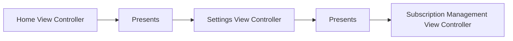
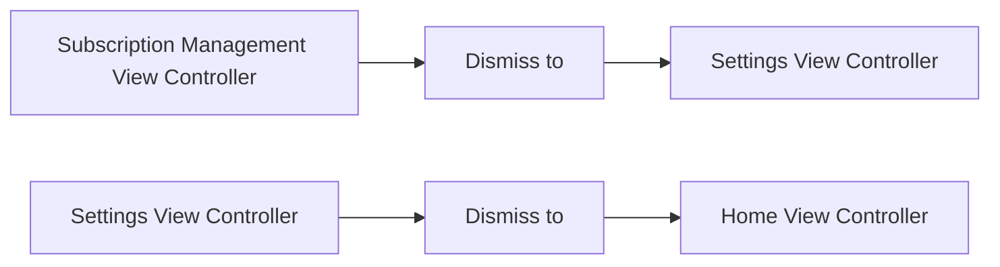
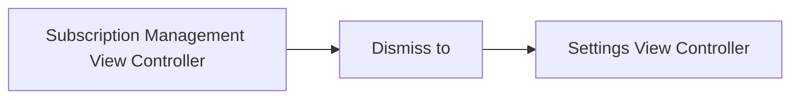

# Dismissing Previous Flows via Closures

In this demo app on success, we want to dismiss the flow to the Home View Controller. On a failure, we simply want to navigate back one step. Here we are using MVC to keep things simple but for your own use case, it can be any architecture you or your team are using.

## Demo App Flow 

#### Presentation Flow

#### Flow Expected on Success

#### Flow Expected on Failure

